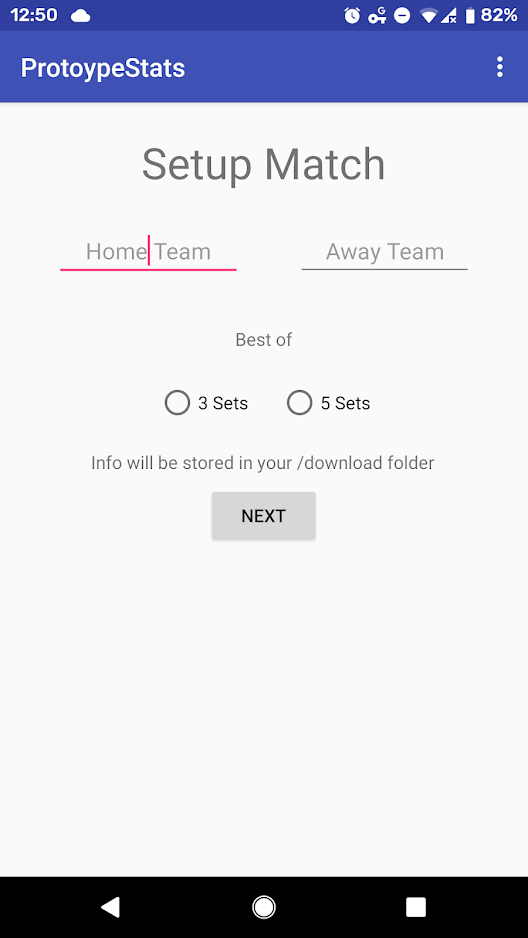
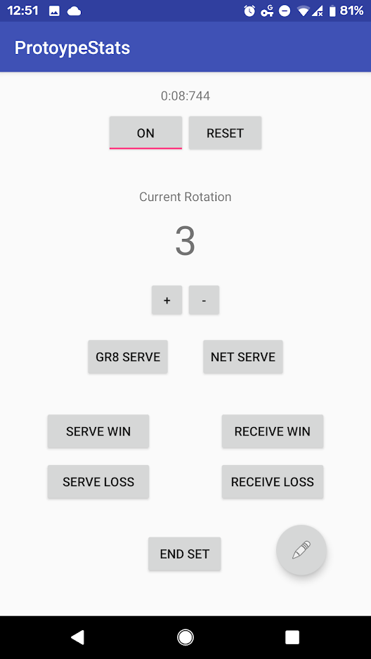

## ProtoypeStats  

Video-matched volleyball stats

While coaching the Georgia Tech Men's Club Volleyball Team I wanted a way to be more quantitative in my decision making, 
so I started looking into stat tracking applications.  
I also wanted to tie these stats to video. Then, after the match I'd be able to watch the stats as they happened.  

So if we have a communication error, post-match I can find it quickly in the match video and start preparing to deal with it next practice.

I found a few good solutions available. Trouble was, we had no money, so the fancy services like Hudl were out. 
And the cheap apps tried to pack in so many options that I wasn't sure it would be possible for one person to
learn to use the UI with how fast-paced of a game volleyball is.

### My Solution

An Android app:  
 Subset of most important stats to me (changable tournament by tournament)
 Tied to video
 
If you write a time like 4:03 in a Youtube video description or comment it becomes clickable and takes you to that point in the video. So there's a stopwatch in the app that you start as you start recording on a GoPro/Camera. Now every stat is timestamped and written to a text file. Copy the text file to the match video on Youtube and now all the stats are linked to the correct moments in the video.

